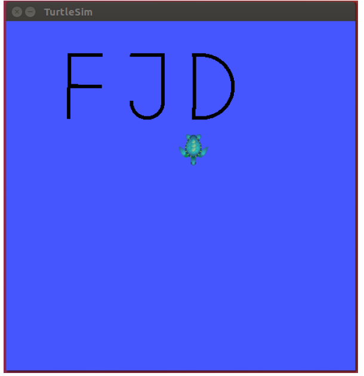
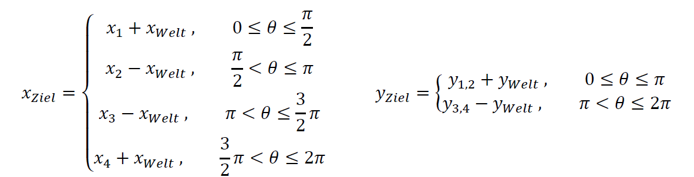

# ROS Turtlesim project WS19/20

This is the project repository of my university course software technology. The repository contains a software project including the Robot Operating System (ROS) and the turtlesim package.

# The task

Programming a simulated mobile robot using the Robot Operating System and the turtlesim package. The virtual robot has to draw the first letters of the first name of each group member.

# Concept

The base concept of the software architecture is a RobotDriver class. It contains all functions to move the robot in the simulated 2D world. At the beginning the robot is move to an absolute coordinate so that it can be ensured that there is enough space to araange all letters next to each other regardless of the position in which the robot is at the initialization state. Geometric calculations were needed to calculate the target coordinates and the associated angles.

## Path planning

The mobile robot is moved to the absolute coordinate P(3|10) and automatically orients itself in the correct direction for the further distance (Phi=180°). The planned movements can be seen in the figure below. Each box mens a distance of 0.5 m. The red arrows visualize the direction of movement and rotation in wich the robot is moving. The green line visualizes the drawing of the letters.

In order to fet from one end of the letter to the next letter, the robot's pen is switched off and then moved in the shortest possible way to the next letter. The example route is shown with the orange line in the picture above. 
New movement instructions are given to the robot at the purple points. All movements during the drawing as well as the movement to the next letter are made by specifying the driving distance or an angle of rotation. The robot leaves the drawing are with a relative movement in the y-direction of -3 m at the end.

## Work area and robot coordinates

The robot must be able to move freely in 2-dimensional space. The current position coordinates within the work are are provided by the virtual robot using a ROS Topic. This workspace is specified by Turtlesim and is limeted to purely positiv values in the x-axis and y-acxis, i.e. the origin of the workspace is at point (0|0). The direction of rotation θ of the robot within the coordinate system can be positive or negative. In order to be able to move the mobile robot save and controled, a second cartesian coordinate system is introduced ath the robot center.

## Orientation of the robot

Since the angle of rotation θ of the robot can be positive as well as negative, it will be converted into an angular φ. The angle φ is defined counterclockwise (polar angle) and can assume values in the invterval from 0 to 2π.

## Linear movement (relativ)

The relative movement in the workspace is based on the calculation of the current angle of rotation θ and the current position in the world coordinate system. The corresponding target coordinates can be determined using geometric triangular relationships, taking into account the 4th quadrant (see figure below).

Are the calculated coordinates within the robot coordinate system linked with the world coordinate system. The result is the absolute target position. This can be calculated as follows:

These target coordinates can be used to determine when the rovot has covered the distance.

## Linear movement (absolute)

The absolute movement in the workspace aims at a certain coordinate in the world coordinate system. Based on the coordinates in the world cooridnate system, the difference can be formed and a triangle can be formed with the target coordinates.

The robot can now turn to the angle θ and the reaches the required target coordinates when driving straight ahead.

## RobotDriver class

The RobotDriver class provides all the necessary functions to be able to move the mobile robot in any direction. The UML diagram below shows the RobotDriver class. During initialization, this required the name of the robot topic and a NodeHandle. The CurrentPoseCallback function is called as soon as a new message with the current position of the mobile robot has been received on the topic.
The pen on the mobile robot can be activated with the ActivatePen function and deactivated again with the DeactivatePen function.
With the TurnClockwise or TurnCounterClockwise function, the robot can be rotated by a relative angle (in degrees).
The TurnToTheta function enables the robot to turn to a certain absolute angle.
The ForwardAndTurn function was implemented to make the robot move in a circle function. By specifying an angle (in degrees) and a circle radius, a scetion of a circle can be moved. Relative linear movements can be achieved with the Forward function.

## Draw class

The Draw class provides all the necessary functions to draw the needed letters in the workspace. The UML diagram below shows the structure of the Draw class. This class needs a pointer to an existing RobotDriver object during initialization. With the functions paint_F, paint_J and paint_D, the corresponding capital letters can be drawn. A robot velocity must always be specified. This velocity applies both linearly and angularly.

